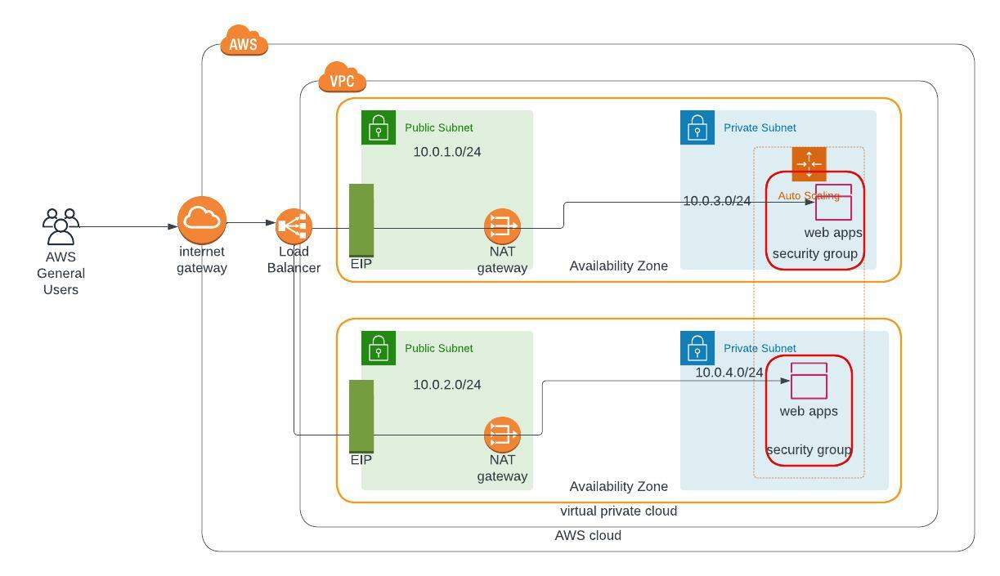

# udagram

## A Minimal instagram
======================
This project deploys the infrastructure shown on below




### Use
**create network stack**
```bash
./create.sh {stack name} templates/network_stack.yml parameters/network_parameters.json
```

**create server stack**
```bash
./create.sh {stack name} templates/server_stack.yml parameters/server_parameters.json
```

**update stack**
```bash
./update.sh {stack name} templates/{template file} parameters/{parameter file}
```